# 🌩️ Admin Dashboard UI Kit

<p align="center">
    <a href="">
        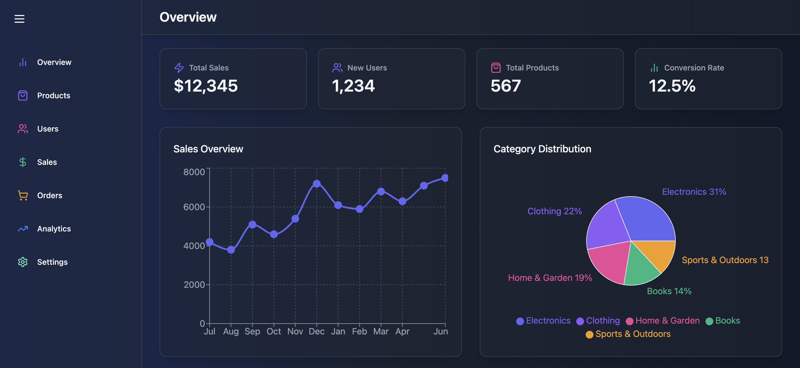
        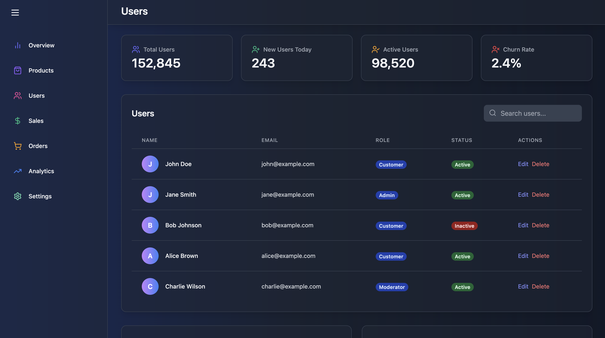
        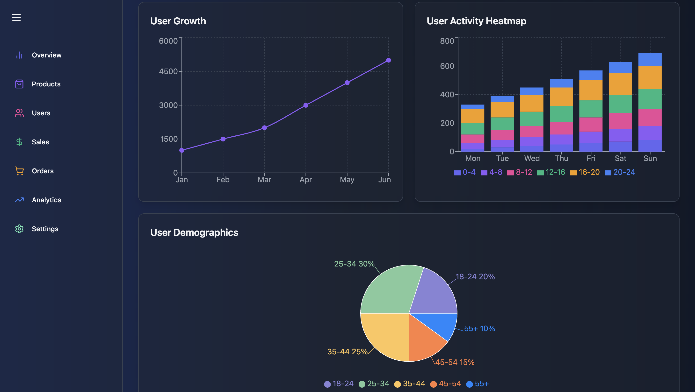
        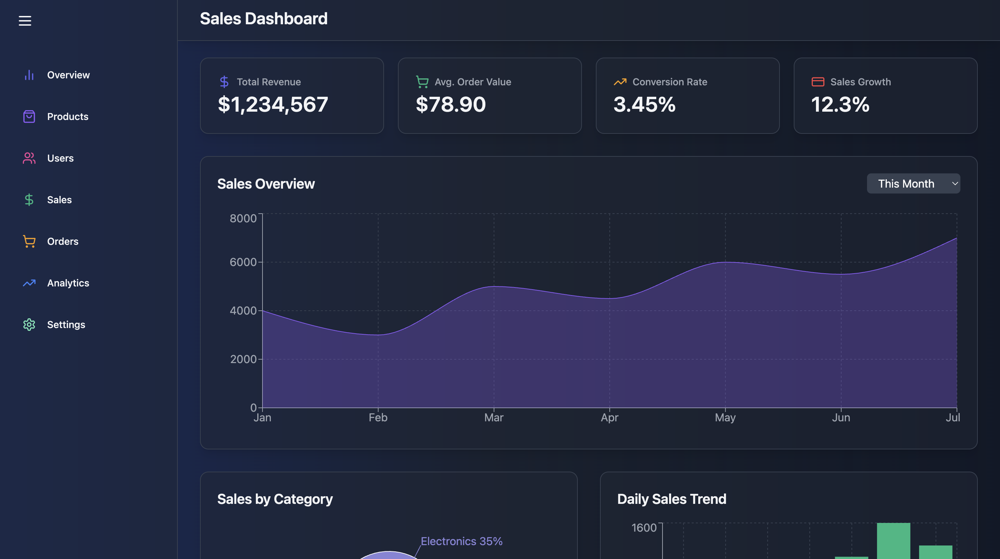
        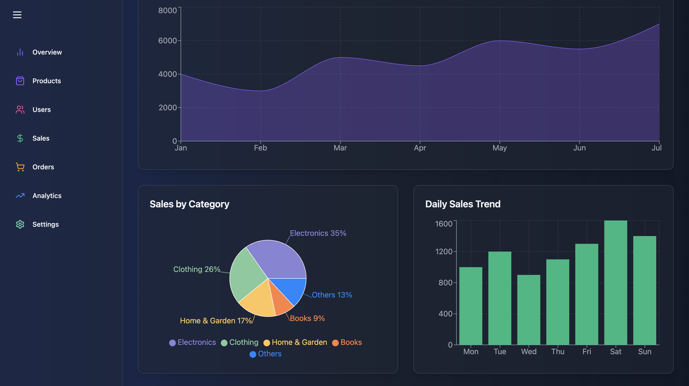
        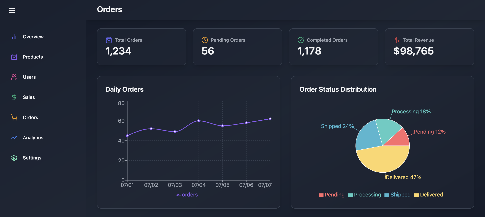
        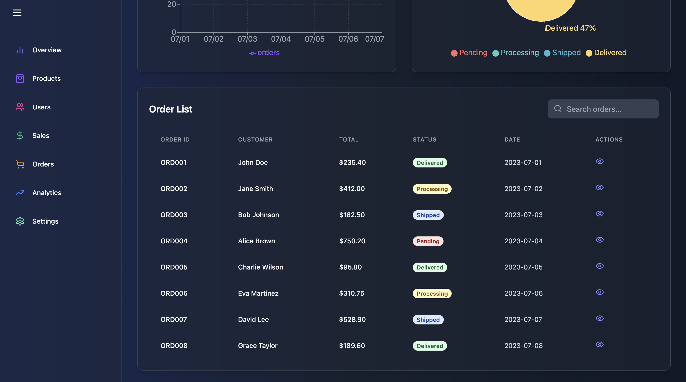
        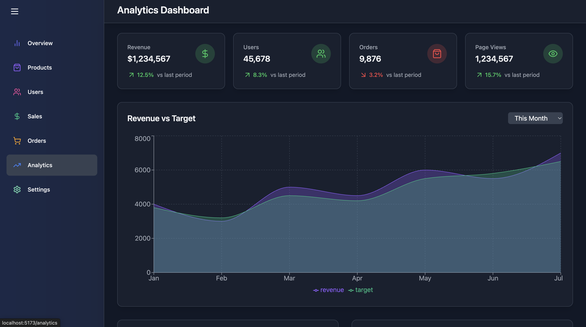
        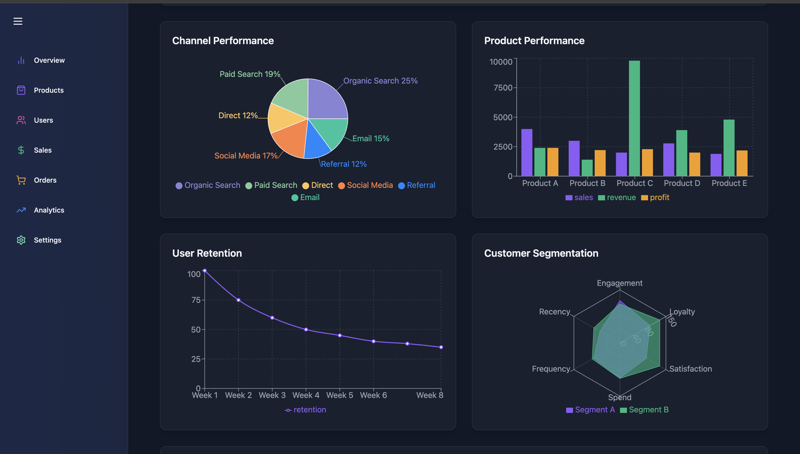
        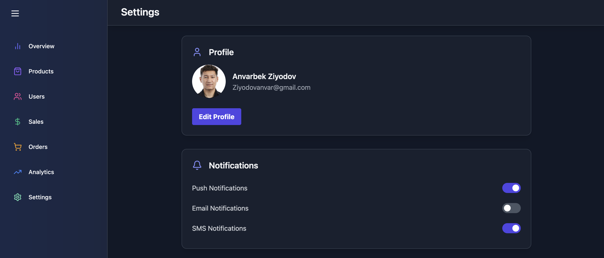
        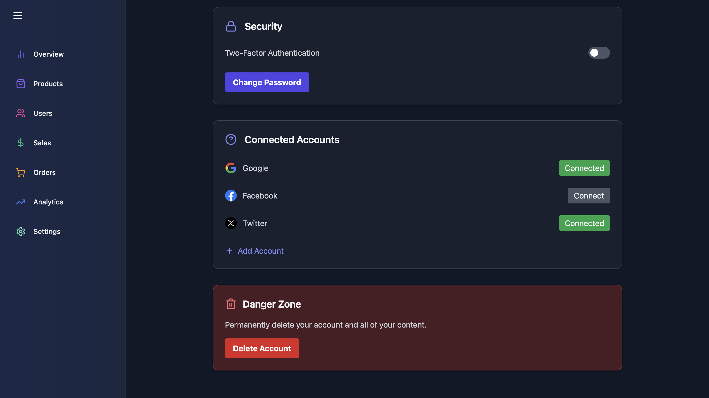
    </a>    
</p>


An admin dashboard template built with the latest front-end technologies. Perfectly suited for any kind of **web application**, whether you're developing an internal tool, SaaS product, or analytics platform.

---

## 🚀 Tech Stack

This project is built with a modern, high-performance tech stack:

- ⚛️ **React 19** – For building reactive, component-based UIs  
- 💨 **Tailwind CSS** – Utility-first CSS framework for fast and clean styling  
- 📈 **Recharts** – Rich and composable charting library for visualizing data  
- 🎞️ **Framer Motion** – High-performance animations and micro-interactions  
- 🔀 **React Router v7** – Client-side routing for seamless navigation  
- ✨ **Lucide Icons** – Clean and customizable icon library  

---

## 🎯 Features

- 📱 **Fully Responsive** – Works perfectly on desktop, tablet, and mobile devices  
- 📈 **Interactive Charts** – Visualize data with elegant bar, line, pie charts, and more  
- 🧱 **Animated Navigation** – Smooth page transitions with Framer Motion  
- 🎨 **Clean UI** – Minimal, modern, and professional design  
- 🔧 **Well-structured Codebase** – Built with scalability and maintainability in mind

---

## 📁 Project Structure

```
admin-dashboard/
├── public/
├── src/
│   ├── assets/         # Static images and icons
│   ├── components/     # Reusable UI components
│   ├── layout/         # Sidebar, navbar, and overall layout
│   ├── pages/          # Dashboard, reports, and other views
│   ├── routes/         # App routes using react-router
│   ├── styles/         # Tailwind CSS configuration and custom styles
│   └── main.jsx        # App entry point
├── tailwind.config.js
├── vite.config.js
└── package.json
```

---

## 🛠️ Getting Started

### 1. Clone the repository

```bash
git clone https://github.com/Mr-Perfectuz/react-admin.git
cd react-admin
```

### 2. Install dependencies

```bash
npm install
```

### 3. Run in development mode

```bash
npm run dev
```

### 4. Build for production

```bash
npm run build
```

### 5. Preview production build

```bash
npm run preview
```

---


## 👨‍💼 Author

Made with ❤️ by [Anvarbek](https://github.com/Mr-Perfectuz)

---

## 📜 License

This project is open-source and free to use under the [MIT License](LICENSE).

---


